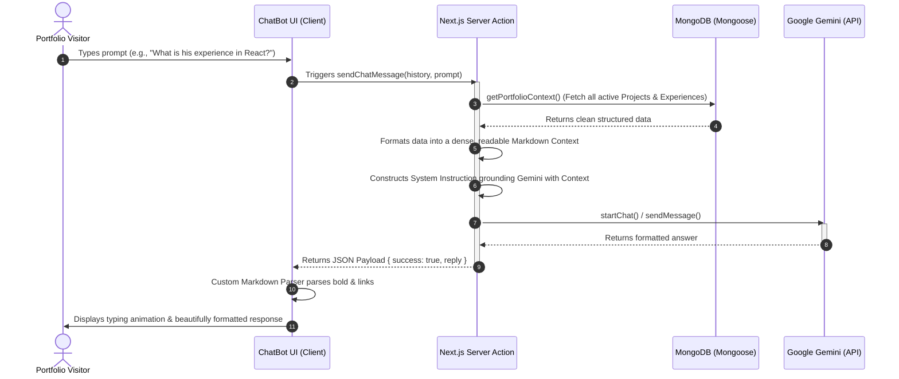

#  Shaikh Abdullah's Personal Portfolio & AI Assistant

A modern, highly optimized personal portfolio website featuring an intelligent, real-time AI Chatbot. The site is built on Next.js 15, styled with TailwindCSS and shadcn/ui components, and powered by a state-of-the-art **Vectorless RAG (Retrieval-Augmented Generation)** engine.

---

##  What is Vectorless RAG?

Traditional RAG architectures chunk text documents, run them through an embedding model, store them in a vector database, and perform cosine similarity matching to retrieve context for user prompts. While powerful for millions of documents, this traditional approach introduces significant drawbacks for compact data environments (like portfolios):
*   **Semantic Missing (Poor Recall)**: Similarity thresholds might miss a relevant project or experience due to slight differences in user phrasing.
*   **Latency & Overhead**: Multiple network hops to the vector store add delay.
*   **Sync Lag**: Changing your portfolio via the admin dashboard requires re-embedding and updating the vector DB index, leading to delayed updates.
*   **High Complexity**: Managing third-party indexes (like Pinecone) or paid vector tiers.

**Vectorless RAG** sidesteps these hurdles entirely by taking advantage of the vast context windows of modern models (like `gemini-2.5-flash`). Because all portfolio projects, experiences, and resume links represent a clean, curated dataset of under 20KB, **we retrieve 100% of the active database content in one fast MongoDB query and inject it directly into the LLM's system instructions.**

###  Key Benefits:
*   **100% Recall Guarantee**: The AI has immediate, unfiltered access to every single project and experience details. It never misses relevant info.
*   **Zero Synchronization Overhead**: Adding or editing a project in your Admin Dashboard instantly updates the chatbot’s knowledge. No embeddings, no sync pipelines!
*   **Ultra-Low Latency**: Simple, localized database query taking under 20ms.
*   **Completely Free & Native**: Bypasses the need for costly vector databases.

---

##  Architectural Workflow

Here is how a visitor’s message flows through the Vectorless RAG engine:



---

##  Technology Stack

*   **Framework**: [Next.js 15](https://nextjs.org/) (React 18, App Router with Turbopack)
*   **Styling**: TailwindCSS, CSS Variables, and shadcn/ui components
*   **Database**: MongoDB (object modeling via [Mongoose](https://mongoosejs.com/))
*   **AI SDK**: `@google/generative-ai` (utilizing `gemini-2.5-flash`)
*   **Theme Integration**: `next-themes` (system-wide seamless dark/light modes)
*   **Analytics**: `@vercel/analytics`

---

##  Getting Started & Setup

### 1. Prerequisites
Ensure you have Node.js (v18+) and npm/yarn installed, and a running MongoDB instance.

### 2. Environment Variables
Create a `.env` or `.env.local` file in the root directory and configure the following:

```env
NODE_ENV=development
MONGODB_URI=mongodb://localhost:27017/ashaikh
NEXT_PUBLIC_CLOUDINARY_CLOUD_NAME=your_cloudinary_cloud_name
NEXT_PUBLIC_CLOUDINARY_UPLOAD_PRESET=your_upload_preset

# Get a free API Key from https://aistudio.google.com/
GEMINI_API_KEY=your_google_ai_studio_api_key
```

### 3. Installation
Install the project dependencies:
```bash
npm install
```

### 4. Development Server
Launch the development server using Next.js Turbopack:
```bash
npm run dev
```

Open [http://localhost:3000](http://localhost:3000) with your browser to experience the site and chat with your Vectorless AI Assistant!
